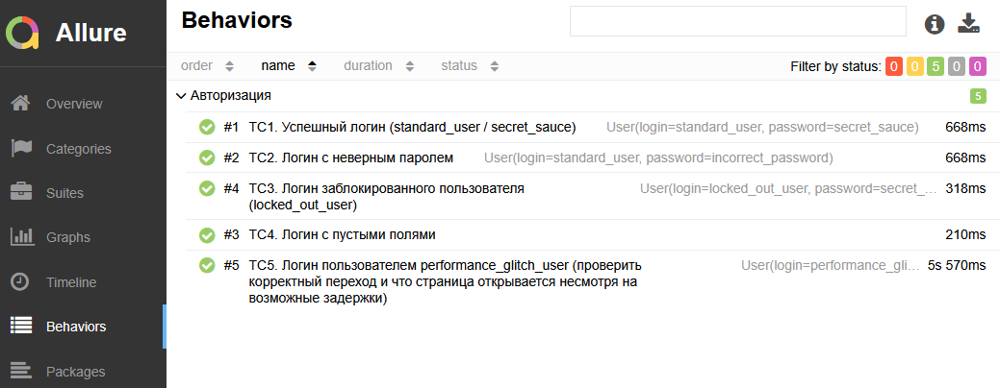

<div align="center">
    <h1>Проект по автоматизации тестирования web-приложения</h1>
</div>

<div align="center">
    <a href="https://www.saucedemo.com/">
        
    </a>
</div>

<div align="center">

<h1 align="center"> Технологический стек</h1>

[](https://www.microsoft.com/ru-ru/download/windows/)
[](https://www.jetbrains.com/)
[](https://www.oracle.com/java/technologies/javase/jdk17-archive-downloads.html)
[](https://maven.apache.org/)
[](https://www.selenium.dev/)
[](https://git-scm.com/)

[](https://docs.qameta.io/allure/)
[](https://testng.org/)

</div>

---

Тестирование пользовательского интерфейса реализовано с применением 
паттерна [PageObject](https://www.selenium.dev/documentation/test_practices/encouraged/page_object_models/).  

```java
  private By userNameTextInput = By.xpath("//input[@id='user-name']");
```

```java
  @Step("Ввести в поле 'Username' имя пользователя")
  public LoginPage fillUserName(String userName) {
    fillTextField(userNameTextInput, userName);
    return this;
  }
```

Методы с аннотацией [@DataProvider](https://testng.org/#_parameters_with_dataproviders),
используются для предоставления параметров тестовому методу.

```java
  @DataProvider(name = "StandardUser")
  public static Object[][] standardUser() {
    return new Object[][]{{
        User.builder()
            .login("standard_user")
            .password(PASSWORD)
            .build()
    }};
  }

  @DataProvider(name = "LockedOutUser")
  public static Object[][] lockedOutUser() {
    return new Object[][]{{
        User.builder()
            .login("locked_out_user")
            .password(PASSWORD)
            .build()
    }};
  }
```

```java
  @Test(
    description = "TC1. Успешный логин (standard_user / secret_sauce)",
    dataProvider = "StandardUser", dataProviderClass = UserDataProvider.class,
    groups = {"ui"})
  @Description("При вводе валидных учетных данных пользователь успешно авторизуется")
  @Owner("Victor.SK")
  public void test1(User user) {
    new LoginPage()
        .fillUserName(user.getLogin())
        .fillPassword(user.getPassword())
        .clickLoginButton()
        .checkProductsHeader();
  }
```

---

Запуск тестов из терминала и формирование отчета: `mvn clean test -P ui allure:report allure:serve`.

<div style="text-align: right;">
    
</div>